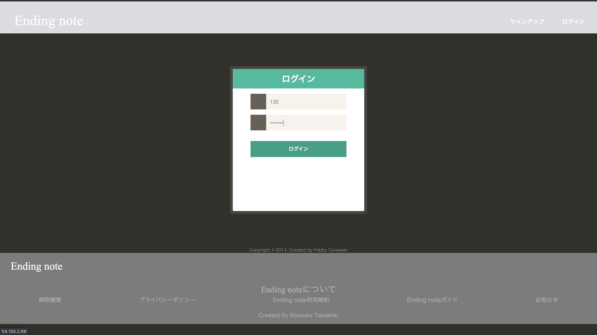
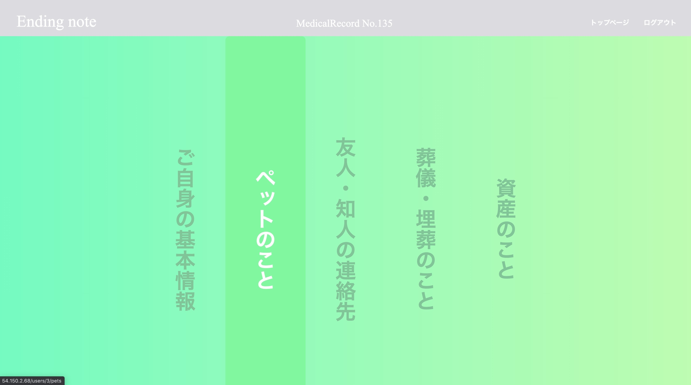
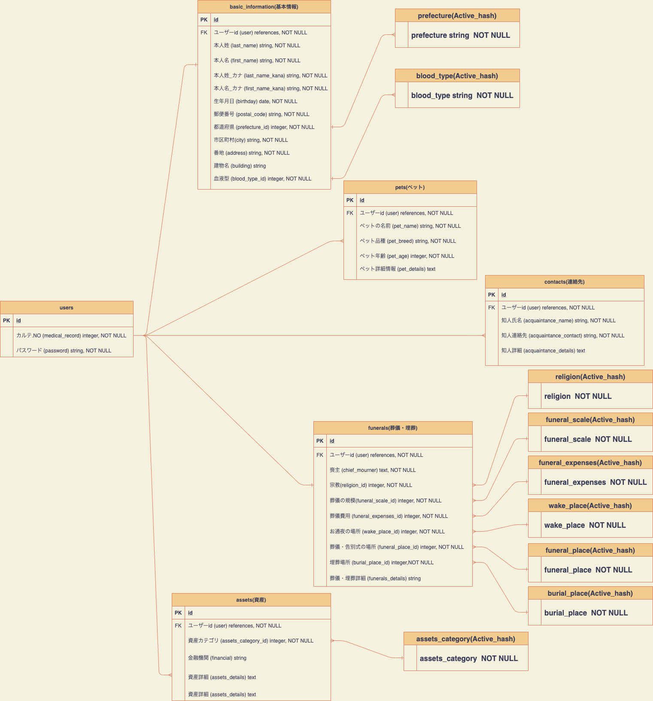

# Ending note
# アプリケーション概要
病院などの閉鎖されたネットワークでの利用を想定した電子版エンディングノート。
# 開発環境
- Ruby 2.6.5
- Ruby On Rails 6.0.0
- WebPacker 4.3.0
- AWS EC2
- Unicorn
- Capistrano
- VScode
# URL
http://54.150.2.68/
# 閲覧用アカウント
- カルテ.NO: 135
- PASS_WORD: test123
# 利用方法
- トップページがログインページなので閲覧用アカウントでログインする

- 5つの各情報一覧ページへ遷移するので登録したい情報を選んでボタンをクリックし遷移する

### 注意：基本情報、葬儀埋葬情報は閲覧用アカウントでは追加で新規の登録を行わないで下さい。その他は追加をしていただいて結構です。
# 目指した課題解決
- アプリが使用される想定現場は病院。
- 終末医療を受ける人や高齢者が使用のユーザー層
- 使用が想定される年齢層が高いのでUIはできるだけ大きくすることを意識した
- 患者自身でもアプリを使用できるが、手が不自由な人や不随の人でも使ってもらえる様に看護師や親族がタブレットやスマホ片手に使用してもいい様にレスポンシブデザインを意識した
# 洗い出した用件
### 優先度高
- 機能:各種情報登録機能
- 目的:エンディングノートとして最低限の機能を持たせる
- 詳細:ユーザーの基本情報、ペット、
知人・友人の連絡先、葬儀埋葬、資産のテーブルを用意し各情報を登録できる様にする
- ストーリー:ログイン後、トップページに各テーブルのindexページに遷移するリンクを設け、indexページに遷移後データがなければ新規登録を行える様にし、すでにデータが有れば編集が行える様にする 
### 優先度中
- 機能:ログイン機能
- 目的:ユーザーをID（カルテ.NO)と、パスワードで管理できるようにする
- 詳細:deviseを用いて登録を行える様にする
- ストーリーログイン時にはカルテ.NOとパスワードだけでログインができる様にする
### 優先度低
- 機能:レスポンシブなデザイン
- 目的:レスポンシブデザインを導入
- 詳細:どんなツールを使用してもデザインが崩れない様にする
- ストーリー:スマホ、タブレットでサイトを覗いてもおかしな余白等が生まれない様にする
# データベース設計
## ER図

## usersテーブル

| Column         | Type    | Options  |
| -------------- | ------- | -------- |
| medical_record | integer | NOT NULL |
| password       | string  | NOT NULL |

### Association
- has_one :basic_information
- has_many :pets
- has_many :contacts
- has_many :funerals
- has_many :assets

## basic_informationテーブル

| Column          | Type       | Options                    |
| --------------- | ---------- | -------------------------- |
| user            | references | NOT NULL, foreign_key:true |
| last_name       | string     | NOT NULL                   |
| first_name      | string     | NOT NULL                   |
| last_name_kana  | string     | NOT NULL                   |
| first_name_kana | string     | NOT NULL                   |
| birthday        | date       | NOT NULL                   |
| postal_code     | string     | NOT NULL                   |
| prefecture_id   | integer    | NOT NULL                   |
| city            | string     | NOT NULL                   |
| address         | string     | NOT NULL                   |
| building        | string     |                            |
| blood_type_id   | integer    | NOT NULL                   |

### Association
- belongs_to :user
- belongs_to_active_hash :blood_type
- belongs_to_active_hash :prefecture

## petsテーブル

| Column      | Type       | Options                    |
| ----------- | ---------- | -------------------------- |
| user        | references | NOT NULL, foreign_key:true |
| pet_name    | string     | NOT NULL                   |
| pet_breed   | string     | NOT NULL                   |
| pet_age     | integer    | NOT NULL                   |
| pet_details | text       |                            |

### Association
- belongs_to :user

## contactsテーブル

| Column               | Type       | Options                    |
| -------------------- | ---------- | -------------------------- |
| user                 | references | NOT NULL, foreign_key:true |
| acquaintance_name    | string     | NOT NULL                   |
| acquaintance_contact | string     | NOT NULL                   |
| acquaintance_details | text       |                            |

### Association
- belongs_to :user

## funeralsテーブル

| Column              | Type       | Options                    |
| ------------------- | ---------- | -------------------------- |
| user                | references | NOT NULL, foreign_key:true |
| chief_mourner       | text       | NOT NULL                   |
| funerals_details    | string     |                            |
| religion_id         | integer    | NOT NULL                   |
| funeral_scale_id    | integer    | NOT NULL                   |
| funeral_expenses_id | integer    | NOT NULL                   |
| wake_place_id       | integer    | NOT NULL                   |
| funeral_place_id    | integer    | NOT NULL                   |
| burial_place_id     | integer    | NOT NULL                   |

### Association
- belongs_to :user
- belongs_to_active_hash :religion
- belongs_to_active_hash :funeral_scale
- belongs_to_active_hash :funeral_expenses
- belongs_to_active_hash :wake_place
- belongs_to_active_hash :funeral_place
- belongs_to_active_hash :burial_place

## assetsテーブル

| Column             | Type       | Options                    |
| ------------------ | ---------- | -------------------------- |
| user               | references | NOT NULL, foreign_key:true |
| assets_category_id | integer    | NOT NULL                   |
| financial          | string     |                            |
| assets_details     | text       |                            |

### Association

- belongs_to :user
- belongs_to_active_hash :assets_category
